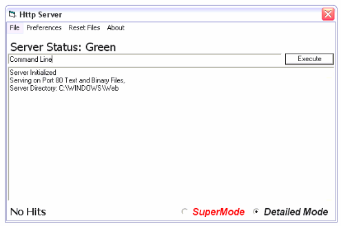



## The Web Server 2

### Description

This is an update of "The Web Server", a submission I made a few weeks ago. This IS the most stable version of the server. It is very fast flexible and easy to use. Start it up and place a index.html in the app directory and tada.

Or place it in the server directory. A server directory is where a server looks for the files it serves. You can set this using Ctrl-D on my program.
 
### More Info
 

             |
---                |---
**Submitted On**   |2003-02-13 02:05:34
**By**             |[JokerDoom](https://github.com/Planet-Source-Code/PSCIndex/blob/master/ByAuthor/jokerdoom.md)
**Level**          |Intermediate
**User Rating**    |5.0 (10 globes from 2 users)
**Compatibility**  |VB 5\.0, VB 6\.0
**Category**       |[Complete Applications](https://github.com/Planet-Source-Code/PSCIndex/blob/master/ByCategory/complete-applications__1-27.md)
**World**          |[Visual Basic](https://github.com/Planet-Source-Code/PSCIndex/blob/master/ByWorld/visual-basic.md)
**Archive File**   |[Http\_Web\_S1543662132003\.zip](https://github.com/Planet-Source-Code/jokerdoom-the-web-server-2__1-43177/archive/master.zip)

